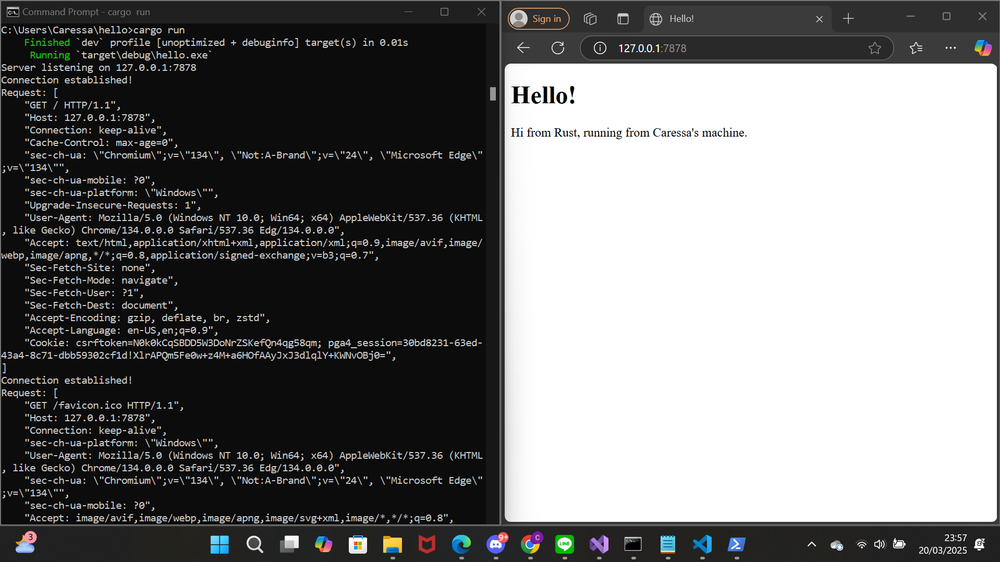
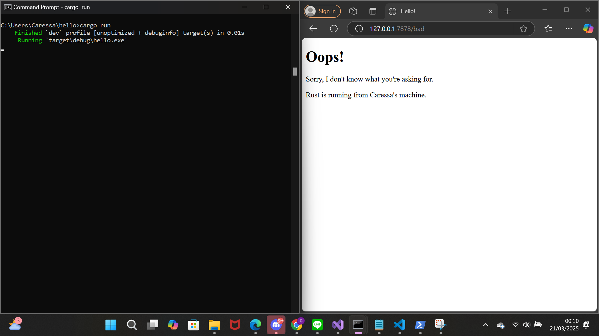

1. Commit 1: Handle-connection, check response
   

   Fungsi `handle_connection` dalam file `main.rs` bertanggung jawab untuk mencetak *raw HTTP request* yang diterima oleh web server yang dijalankan. Fungsi ini menerima sebuah *mutable* `TcpStream` sebagai parameter, yang kemudian direferensikan ke dalam `BufReader`. Dengan bantuan `BufReader`, permintaan HTTP yang diterima akan dipisahkan berdasarkan karakter *newline* atau CRLF. Selanjutnya, dilakukan pemanggilan `unwrap()` karena metode `lines()` mengembalikan nilai bertipe `Result<String, Error>`. Hasil dari `unwrap()` kemudian diiterasi dan diambil nilainya selama baris yang dibaca tidak kosong. Proses *parsing* ini menghasilkan sebuah `Vector`, yaitu struktur data sejenis *array* dengan ukuran yang dapat berubah, yang kemudian dicetak ke layar.

2. Commit 2: Returning HTML

   Fungsi `handle_connection` yang baru akan mengirimkan *raw HTTP response* dengan status `200 OK`. Respon tersebut akan menyertakan data `HTML`, sehingga jika permintaan dikirim melalui browser, pengirim dapat melihat langsung tanggapan dari server di layar. Untuk menyertakan data `HTML` dalam respon, diperlukan header `Content-Length` dalam *HTTP response*, yang berfungsi memberi tahu browser mengenai panjang *body* dari respon yang dikirimkan oleh server. Berikut adalah *screenshot* hasil eksekusi kode terbaru.
   

3. Commit 3: Validating request and selectively responding

   Setelah dilakukan modifikasi lebih lanjut, fungsi `handle_connection` kini mengirimkan *raw HTTP Response* berdasarkan status *HTTP Request* yang diterima. Jika *HTTP Request* yang diterima merupakan `GET` request dengan URI `/` dan menggunakan versi HTTP `HTTP/1.1`, maka server akan mengembalikan halaman `hello.html`. Sebaliknya, jika permintaan tidak memenuhi kriteria tersebut, server akan mengembalikan halaman `404.html`.  

    Cara membedakannya cukup sederhana, yaitu dengan mengambil baris pertama dari *raw HTTP Request* dan memeriksa apakah baris tersebut sama dengan string `"GET / HTTP/1.1"`. Dengan pendekatan ini, fungsi `handle_connection` kini berperan sebagai mekanisme *routing* sederhana, yang mengembalikan halaman HTML yang sesuai berdasarkan *request* yang diterima.  

    Namun, saat pertama kali mengimplementasikan kode ini dengan mengikuti Chapter 20 dari buku yang digunakan sebagai referensi, ditemukan adanya duplikasi kode yang cukup mencolok, terutama pada bagian *conditional* untuk menentukan apakah `hello.html` harus dikembalikan. Oleh karena itu, dilakukan proses *refactoring* untuk menghilangkan duplikasi tersebut. Proses ini mengikuti langkah-langkah yang terdapat dalam buku, dengan memisahkan `status_line` serta nama file HTML yang akan dikembalikan, kemudian menentukannya berdasarkan hasil *request* yang diterima. Teknik ini menyerupai penggunaan *ternary operator*, tetapi dalam bentuk yang lebih eksplisit dan mudah dipahami.
   
    

 4. Commit 4: Simulation of slow request

    Dengan modifikasi pada fungsi `handle_connection` agar dapat menangani `GET Request` ke URI `/sleep`, muncul sebuah permasalahan dalam pengelolaan permintaan. Ketika seseorang mengakses URI tersebut, pengguna lain yang ingin mengakses URI `/` harus menunggu hingga permintaan pertama diproses dan mendapatkan respons dari server sebelum menerima respons mereka sendiri.  

    Hal ini terjadi karena fungsi `handle_connection` berjalan dalam lingkungan *single-threaded*. Dengan kata lain, server hanya dapat menangani satu permintaan dalam satu waktu. Jika ada bagian dalam fungsi tersebut yang memerlukan waktu eksekusi yang cukup lama, maka semua permintaan lain yang masuk selama periode tersebut harus menunggu hingga fungsi `handle_connection` selesai dieksekusi sepenuhnya.  

    Dalam kasus ini, ketika ada permintaan ke URI `/sleep`, fungsi `handle_connection` akan tertunda selama 10 detik sebelum mengembalikan halaman `hello.html`. Akibatnya, pengguna lain yang mengakses URI lain juga harus menunggu hingga proses tersebut selesai. Jika banyak pengguna yang mengakses `/sleep` secara bersamaan, server akan menjadi sangat lambat dalam menangani permintaan lain, sehingga pengalaman pengguna secara keseluruhan menjadi tidak optimal.  

5. Commit 5:  Multithreaded server using Threadpool

   Pada milestone ini, server sederhana yang sebelumnya berjalan secara sequential telah ditingkatkan dengan dukungan multithreading menggunakan konsep thread pool. Implementasi ini memungkinkan server untuk menangani banyak request secara simultan, meningkatkan efisiensi dan performa secara signifikan.

    Dalam proses pengembangan, tantangan utama yang dihadapi adalah memastikan bahwa thread pool dapat mendistribusikan pekerjaan secara optimal tanpa menyebabkan kondisi race atau deadlock. Untuk mengatasi hal ini, digunakan Arc<Mutex<T>> agar receiver dapat diakses oleh beberapa thread secara aman. Selain itu, mekanisme graceful shutdown juga diterapkan agar setiap thread dapat berhenti dengan baik ketika server ditutup.

    Hasil akhir dari milestone ini menunjukkan peningkatan performa server, di mana beberapa request kini dapat diproses secara bersamaan oleh thread yang berbeda. Uji coba dilakukan dengan berbagai metode, seperti mengakses endpoint secara bersamaan dan melakukan stres test untuk memastikan kestabilan sistem. Dengan implementasi ini, server lebih siap menangani beban kerja yang lebih besar dan respons lebih cepat dibandingkan versi sebelumnya.

6. Bonus : (Bonus) Function improvement

   Dalam bagian bonus ini, saya mencoba mengganti fungsi new dengan build untuk menginisialisasi ThreadPool. Perubahan ini memungkinkan pendekatan yang lebih eksplisit dalam membangun instance, sesuai dengan konvensi Rust yang lebih idiomatis. Dengan menggunakan build, saya dapat menambahkan validasi tambahan atau logika inisialisasi yang lebih fleksibel sebelum mengembalikan instance ThreadPool.

   Salah satu tantangan utama yang saya hadapi adalah memastikan bahwa perubahan dari new ke build tidak mengganggu cara kerja pool dalam menangani thread. Saya juga membandingkan performa dan kejelasan kode sebelum dan sesudah perubahan ini. Hasilnya, pendekatan build memberikan lebih banyak fleksibilitas dalam menangani kemungkinan error, seperti jika jumlah thread yang dimasukkan tidak valid.

   Selain itu, saya juga mengeksplorasi bagaimana perubahan ini berpengaruh pada cara server menangani request, terutama dalam kasus GET /sleep, di mana thread harus menunggu sebelum mengembalikan respons. Hal ini mengajarkan saya lebih dalam tentang bagaimana thread management, error handling, dan concurrency dalam Rust bekerja. Dari pengalaman ini, saya semakin memahami bagaimana desain API dalam Rust bisa dibuat lebih aman dan fleksibel, terutama dalam konteks membangun server HTTP sederhana.
